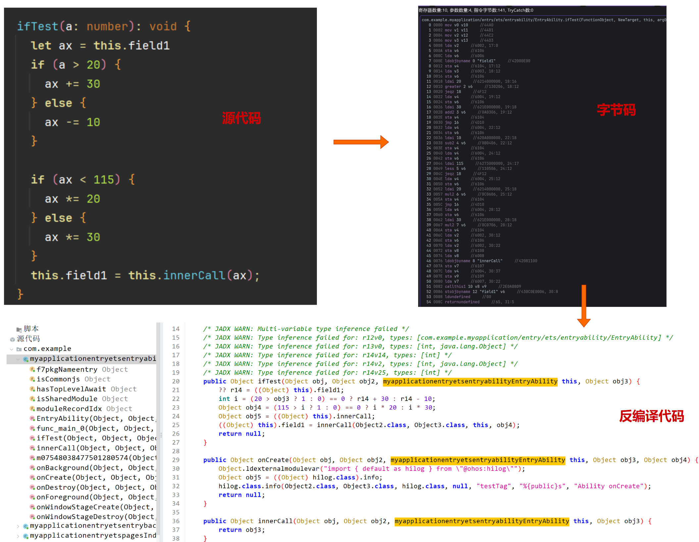

# abc-decompiler

abc-decompiler 基于 [jadx](https://github.com/skylot/jadx/) 和 [abcde](https://github.com/Yricky/abcde/tree/main) 实现的鸿蒙 [abc/方舟字节码](https://developer.huawei.com/consumer/cn/doc/harmonyos-guides-V5/arkts-bytecode-fundamentals-V5#%E6%9C%AF%E8%AF%AD%E5%92%8C%E7%BA%A6%E6%9D%9F) 的反编译工具.

目前还在开发中，欢迎有兴趣的兄弟一起讨论、研究.


## #1 使用方法

下载或者编译 jar 包，然后运行把 hap 文件解压缩，将其中的 modules.abc 字节码文件拖入工具




## #2 进展与计划

分析了方舟的字节码，有很大部分与 DEX 字节码语义相近，且 jadx 比较成熟，于是基于 jadx 实现反编译器。

目前的进展：
- [x] 修改输入部分代码，可以拖入 abc 文件分析
- [x] 粗略实现了字节码（大部分特殊指令采用伪函数实现），目前实现指令 [227](https://github.com/ohos-decompiler/abc-decompiler/issues/6) 条，字节码总数：[282 条 (其中可用指令条数为 227 条)](https://developer.huawei.com/consumer/cn/doc/harmonyos-guides-V5/arkts-bytecode-fundamentals-V5#%E6%9C%AF%E8%AF%AD%E5%92%8C%E7%BA%A6%E6%9D%9F).
- [ ] 优化字节码表示，根据需要定制 IR.

计划：
- [x] 先补齐字节码，让代码能看.
- [ ] 开发 abc 的反编译优化模块（在 jadx 中为 Pass），优化代码显示，让代码好看.
- [ ] 实现数据流分析，自动化漏洞挖掘.


## #3 关键代码路径

字节码解析: [jadx-core/src/main/java/jadx/core/dex/instructions/InsnDecoder.java](./jadx-core/src/main/java/jadx/core/dex/instructions/InsnDecoder.java)

jadx 自带的 Pass: [jadx-core/src/main/java/jadx/core/dex/visitors](./jadx-core/src/main/java/jadx/core/dex/visitors)


## #4 编译

JDK 版本：JDK17+

需要编译 patch 过的 [abcde](https://github.com/ohos-decompiler/abcde) 库并安装到本地 maven 仓

```
 ./gradlew publishToMavenLocal
```

如果正确执行，命令行中会有如下输出

```
Done!
groupId: io.github.yricky.oh //这部分为下述$groupId
version: 0.1.0-dev-4d03a43 //这部分为下述$version
```

vscode 全局搜索替换项目下所有 gradle文件中的 `io.github.yricky.oh:abcde-jvm:0.1.0-dev-xxx` 为实际版本号.

```
   dependencies {
        // implementation("$groupId:abcde-jvm:$version")
        implementation("io.github.yricky.oh:abcde-jvm:0.1.0-dev-4d03a43")
    }
```

然后编译 abc-decompiler

```
./gradlew dist
```


