# 鸿蒙 ABC 反编译

[abc-decompiler](https://github.com/ohos-decompiler/abc-decompiler) 是基于 [jadx](https://github.com/skylot/jadx/) 和 [abcde](https://github.com/Yricky/abcde/tree/main) 实现的鸿蒙 [abc/方舟字节码](https://developer.huawei.com/consumer/cn/doc/harmonyos-guides-V5/arkts-bytecode-fundamentals-V5#%E6%9C%AF%E8%AF%AD%E5%92%8C%E7%BA%A6%E6%9D%9F) 的反编译工具.

‍

目前的思路是常规的条件语句（if switch while for）参考 dex 字节码翻译逻辑，然后 abc 的特殊指令比如 ldlocalmodulevar 在翻译 IR 阶段先把他们当作函数（这样就可以复用 jadx 中的 pass 计算出实际常量入参），然后开发 pass 把这些特殊函数转换下.

‍

下面介绍实现的部分代码逻辑

‍

## 主要流程

‍

jadx 的主要工作流程：

1. 通过 jdax-plugins 里面的各种 input 插件，比如  jadx-dex-input 从输入的文件中提取类、方法签名、指令流（字节码）等信息
2. 然后进入 jadx-core 将指令流翻译为 jadx 的内部 ir
3. 之后由 jadx-core 中的数十个 Pass 对生成的 IR 流进行代码优化，结构恢复
4. 最后将 IR 输出为反编译代码

​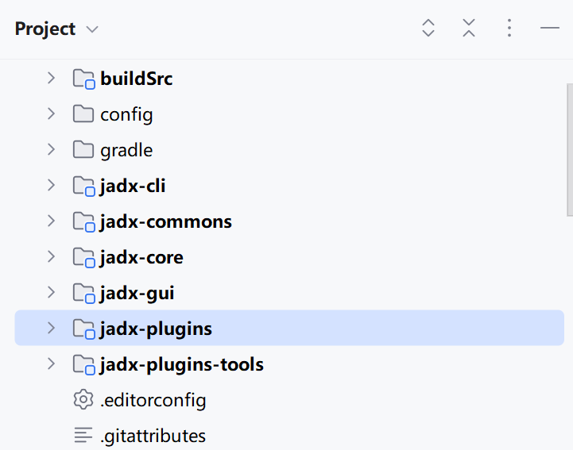​

‍

输入文件解析位于 jadx. plugins. input. dex. DexFileLoader

​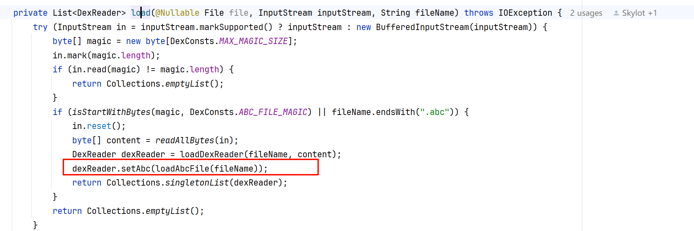​

‍

解析后进入 jadx. core. dex. nodes. ClassNode 解析文件中的类和方法并创建对应的 Class 和 Method 节点，用于后面分析。

‍

当用户选择对应的类后，会触发类中所有方法的反编译，jadx 的 IR 使用 InsnNode 表示

​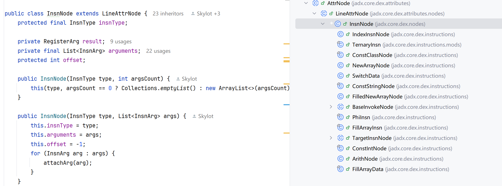​

insnType 表示 IR 的类型

​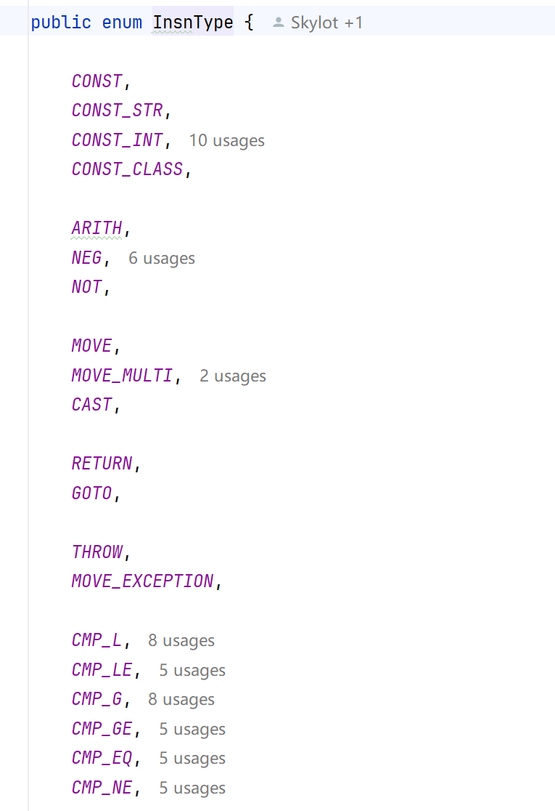​

将字节码翻译为 IR 的代码位于 jadx. core. dex. instructions. InsnDecoder 的 decode 方法中

​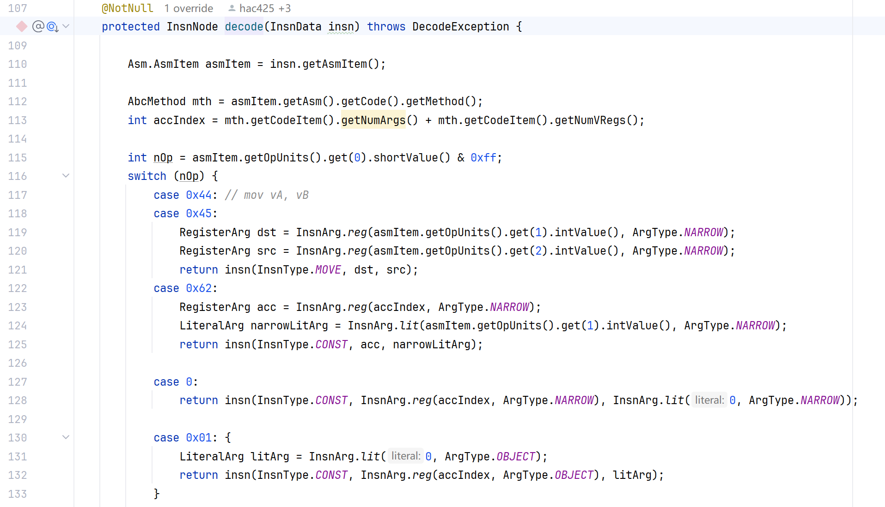​

‍

IR 生成后调用 jadx.core.dex.visitors 下的代码优化器（Pass）生成控制流并对代码进行优化

​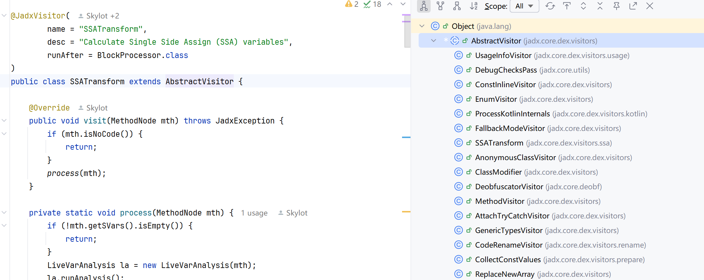​

‍

Pass 处理完后进入 jadx. core. codegen. InsnGen 生成反编译代码.

​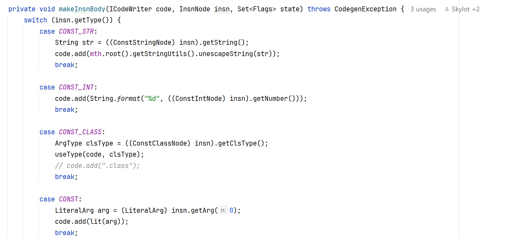​

‍

‍

## 指令翻译

‍

### 普通指令

‍

对于能在 Dex 字节码中找到对应的指令，使用类似逻辑生成 IR 即可以 mov 指令为例

```html
			case 0x44: // mov vA, vB
			case 0x45:
				RegisterArg dst = InsnArg.reg(asmItem.getOpUnits().get(1).intValue(), ArgType.NARROW);
				RegisterArg src = InsnArg.reg(asmItem.getOpUnits().get(2).intValue(), ArgType.NARROW);
				return insn(InsnType.MOVE, dst, src);
```

其格式如下：

​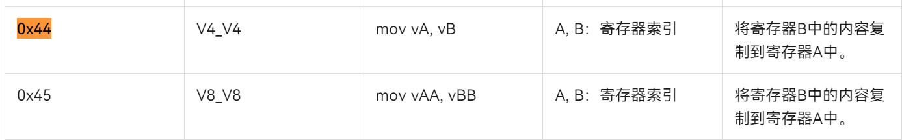​

‍

asmItem 是通过 [abcde](https://github.com/Yricky/abcde/) 反汇编生成的指令其类型为 `AsmItem`​

```html
    /**
     * 字节码中单个指令的汇编对象
     * @param asm 指令所在方法
     * @param codeOffset 本条指令在方法指令段中的相对offset，从0开始
     * @param ins 本条指令的指令格式
     */
    class AsmItem(
        val asm:Asm,
        val ins:Inst,
        val codeOffset:Int,
        val nextOffset:Int
    )
```

其中的 `opUnits`​ 存放解码后的指令各个成员，比如 mov, vA, vB 对应的值，翻译代码中就是通过 getOpUnits 获取 vA 和 vB ，然后生成寄存器参数节点 dst 和 src ，然后创建 MOVE 指令。

‍

### 复杂指令

对于复杂指令用函数替代，后面代码生成时再生成对应的文本

​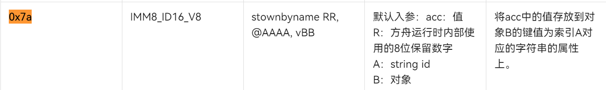​

‍

这里 @AAAA 表示 A 是一个字符串索引，可以通过 ((InstFmt.SId) formats.get(2)).getString(asmItem1) 获取其实际的字符串值，该 API 内部会通过索引查找字符串表，找到真实的字符串

```html
			case 0x7a: {
				Asm.AsmItem asmItem1 = insn.getAsmItem();
				MethodInfo mthInfo = MethodInfo.fromAsm(root, insn.getAsmItem(), 3, "stownbyname");
				InvokeNode invoke = new InvokeNode(mthInfo, InvokeType.STATIC, 3);
				List<InstFmt> formats = asmItem1.getIns().getFormat();
				String fieldName = ((InstFmt.SId) formats.get(2)).getString(asmItem1);

				invoke.addArg(InsnArg.reg(asmItem1.getOpUnits().get(3).intValue(), ArgType.OBJECT));
				invoke.addArg(InsnArg.wrapArg(new ConstStringNode(fieldName)));
				invoke.addArg(InsnArg.reg(accIndex, ArgType.NARROW));
				return invoke;
			}
```

然后生成调用 stownbyname 函数的调用指令并将指令的参数作为函数的参数提供给函数，最后在代码生成时提取对应参数值，生成代码

```html
class StownByNameHandler implements SpecialMethodHandler {
	@Override
	public void process(InsnGen gen, InvokeNode insn, ICodeWriter code, MethodNode callMthNode) throws CodegenException {
		gen.addArg(code, insn.getArg(0), false);
		code.add(".");
		gen.addStrArg(code, insn.getArg(1));
		code.add(" = ");
		gen.addArg(code, insn.getArg(2), false);
	}
}
```

这样的好处是复用了 jadx 原始的常量传播结果，因为在指令翻译阶段，是无法知道 acc 即操作对象的具体值或者名称，原始 Dex 指令中也没有类似场景.

‍

### 跳转指令

对于条件分支的处理感觉和汇编指令类似，将 while for if 处理为 cmp + jxx 指令。

‍

主要计算好跳转目标地址，然后构建相应的指令.

​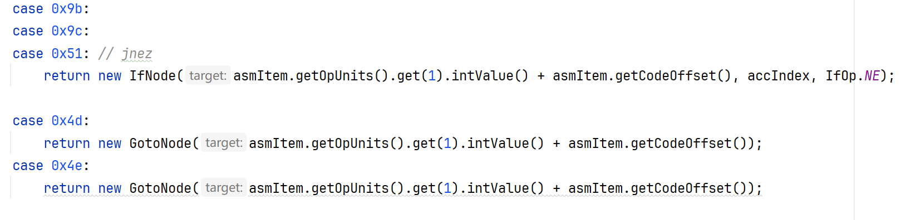​

‍

相关字节码描述

​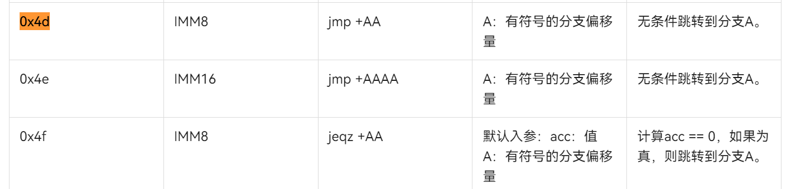​

‍

‍
